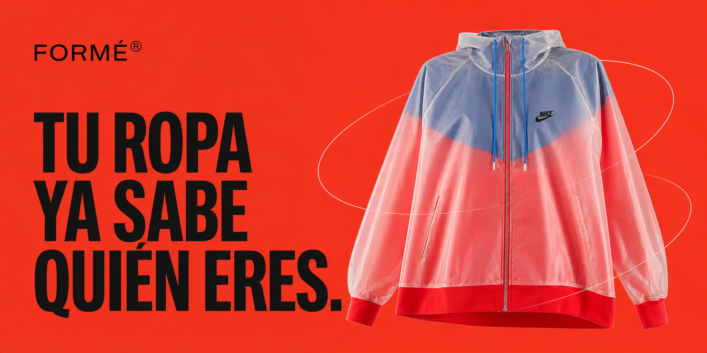

# Formé

**A virtual wardrobe that turns the clothes people already own into a living visual identity.**

[](https://forme.gallery)

[Live experience](https://forme.gallery)

## The idea

Most wardrobe tools begin with shopping. Formé begins with what is already there.

People upload their full closet, Formé isolates each garment into a clean visual archive, and the wardrobe becomes material for composing outfits, understanding personal taste, and exploring new combinations. The product brings editorial fashion language to a practical, everyday system.

## Creative direction

The identity is built around quiet editorial tension: warm paper and greige surfaces, black ink, a single red signal color, large serif typography, compact utilitarian labels, and garment photography treated as the main visual voice.

The system moves between two modes without losing its character:

- an ordered personal archive
- an expressive styling and discovery space

Mobile is the primary canvas. Controls stay restrained so that clothing, silhouette, texture, and proportion remain central.

## Product system

- full-closet photo intake
- automated garment cutouts and ghost-mannequin presentation
- filters, favorites, and wardrobe organization
- three-layer outfit composition
- taste calibration and personal style profiles
- AI-assisted garment and outfit generation
- secure Google authentication and private media storage

## Role

Creative direction, product concept, visual system, interaction design, AI workflow design, and implementation by [Tata Portal](https://tataportal.xyz).

## Technology

Next.js, React, TypeScript, Vinext, Cloudflare Workers, D1, R2, Cloudflare Images, Drizzle ORM, Tailwind CSS, and OpenAI.

## Local development

```bash
npm install
npm run dev
```

```bash
npm run test
npm run deploy
```

Runtime secrets are configured in Cloudflare and are never committed to the repository.
